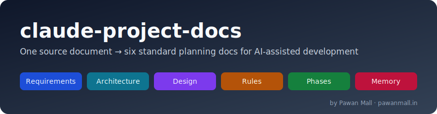
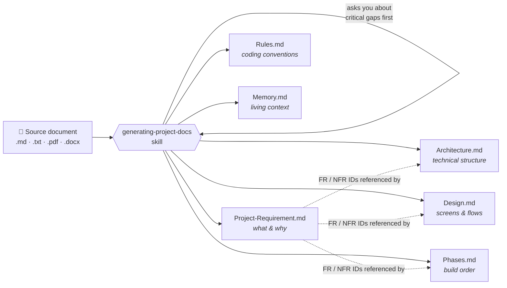

<p align="center">
  
</p>

<p align="center">
  <a href="LICENSE"></a>
  
  
  <a href="https://www.pawanmall.in"></a>
</p>

# claude-project-docs

A [Claude Code](https://claude.com/claude-code) skill that transforms **one source document** (PRD, proposal, brief, spec, SRS, client email, meeting notes) into **six standard planning documents** for AI-assisted development.

Source documents can be **`.md`, `.txt`, `.pdf`, `.docx`**, HTML, or any readable file — or several files treated as one source. (Legacy binary `.doc` files should be re-saved as `.docx` or `.pdf` first.)

| File | Answers |
|------|---------|
| `Project-Requirement.md` | WHAT to build and WHY — goals, users, FR/NFR tables, scope |
| `Architecture.md` | HOW it's structured — stack, components, data model, integrations, ADRs |
| `Design.md` | WHAT it looks like — screens, user flows, visual style, validation rules |
| `Rules.md` | HOW to write code for it — standards, structure, git workflow, do/don't |
| `Phases.md` | WHEN things get built — phased plan with tasks and exit criteria |
| `Memory.md` | WHERE the project stands — living context file with an update protocol |

The skill enforces **source traceability**: every statement in the generated docs is either grounded in your source document, explicitly marked `*(assumed)*` with reasoning, or flagged as `⚠ GAP` for you to answer. Nothing is silently invented.

## How it works



## Installation (Choose One)

### Marketplace (Recommended)

Inside a Claude Code session:

```
/plugin marketplace add MrPawanMall/claude-project-docs
/plugin install project-docs@project-docs
```

Or from your terminal:

```bash
claude plugin marketplace add MrPawanMall/claude-project-docs
claude plugin install project-docs@project-docs
```

Restart Claude Code when prompted.

### Install from a GitHub URL

The marketplace command also accepts the full repository URL:

```bash
claude plugin marketplace add https://github.com/MrPawanMall/claude-project-docs
claude plugin install project-docs@project-docs
```

### Install via skills.sh

```bash
npx skills add MrPawanMall/claude-project-docs
```

> **Note:** This installs the skill only (no plugin metadata). Works with Claude Code, Cursor, and every other agent supported by [skills.sh](https://skills.sh/) — add `-g` for a global (user-level) install, or `--agent claude-code` to target Claude Code specifically.

### Install via Agent Skills CLI

```bash
npx agent-skills-cli@latest install https://github.com/MrPawanMall/claude-project-docs
```

> **Note:** This installs the skill only (no plugin metadata). Supports exporting to 40+ AI agents including Claude Code, Cursor, GitHub Copilot, and Windsurf. The skill is validated against the [Agent Skills specification](https://agentskills.io/specification).

### Local Development

```bash
git clone https://github.com/MrPawanMall/claude-project-docs.git
cp -r claude-project-docs/skills/* ~/.claude/skills/
```

Windows (PowerShell):

```powershell
git clone https://github.com/MrPawanMall/claude-project-docs.git
Copy-Item -Recurse claude-project-docs\skills\* "$env:USERPROFILE\.claude\skills\"
```

Restart Claude Code after copying.

## Test Your Installation

Verify the skill is registered:

```bash
claude plugin list        # plugin installs — look for project-docs (enabled)
npx skills list -g        # skills.sh installs
```

Then try it on a real document in a Claude Code session:

```
# Point it at any source document
"Use generating-project-docs on docs/client-brief.pdf"

# Or just describe what you want
"Create the project planning docs from proposal.md"
"Set up project docs for AI-assisted development from this PRD"
```

You should see Claude read the source completely, ask about critical gaps, and generate the six documents into `docs/`.

## Usage

Start a Claude Code session in your project and point the skill at your source document:

```
Use the generating-project-docs skill on requirements/client-brief.pdf
```

or just describe it naturally — the skill triggers on requests like:

```
Create the project planning docs from docs/proposal.md
Set up project docs for AI-assisted development from this PRD
```

Claude will:

1. Read the source document completely
2. Ask you about any **critical gaps** (unknown tech stack, unclear users, missing success criteria) before generating
3. Generate all six documents into `docs/` (or a folder you specify), cross-linked by requirement IDs (`FR-1`, `NFR-2`, `P-1`)
4. Report the assumptions it made and the open gaps that need your answers

### Working with the generated docs

- Answer the `⚠ GAP` items and remove the markers as you resolve them
- `Memory.md` is a **living file** — tell Claude to read it at the start of each session and update it at the end (its update protocol is embedded in the file)
- Keep the other five docs current by following the Decision Log's "Affects" column in `Memory.md`

## What's in the box

```
claude-project-docs/
├── .claude-plugin/
│   ├── marketplace.json          # Marketplace manifest
│   └── plugin.json               # Plugin manifest
├── assets/
│   └── banner.svg                # README banner image
├── skills/
│   └── generating-project-docs/
│       ├── SKILL.md              # The skill: process, provenance rules, checklist
│       └── templates/            # One template per generated document
│           ├── project-requirement.md
│           ├── architecture.md
│           ├── design.md
│           ├── rules.md
│           ├── phases.md
│           └── memory.md
├── LICENSE
└── README.md
```

## Why these six documents?

They separate concerns that usually get tangled in one giant README:

- **Stable context** (requirements, architecture, design) that AI agents can load once
- **Behavioral contract** (rules) that keeps every session's code consistent
- **Execution state** (phases, memory) that survives between sessions — so a fresh Claude session picks up exactly where the last one left off

## Contributing

Issues and PRs welcome. If you add or change template sections, update the table in `SKILL.md` and this README.

## Author

**Pawan Mall**

- 🌐 Website: [www.pawanmall.in](https://www.pawanmall.in)
- 💻 GitHub: [@MrPawanMall](https://github.com/MrPawanMall)

## License

[MIT](LICENSE) © [Pawan Mall](https://www.pawanmall.in)
